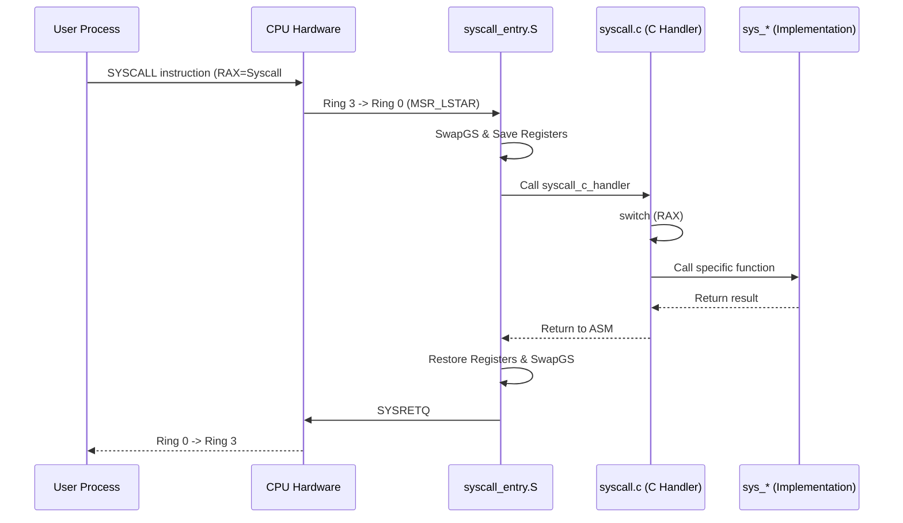
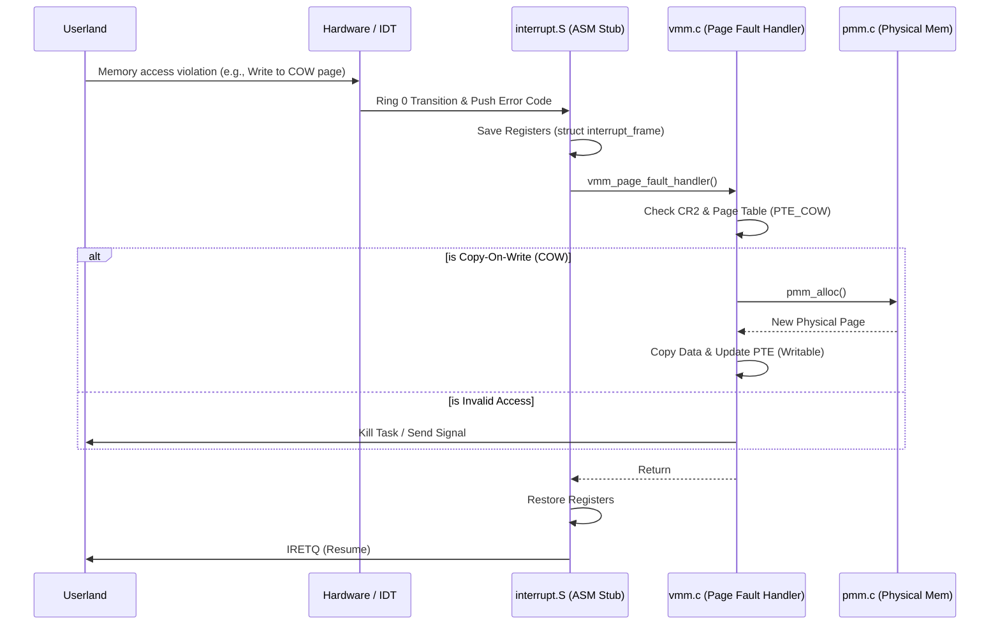
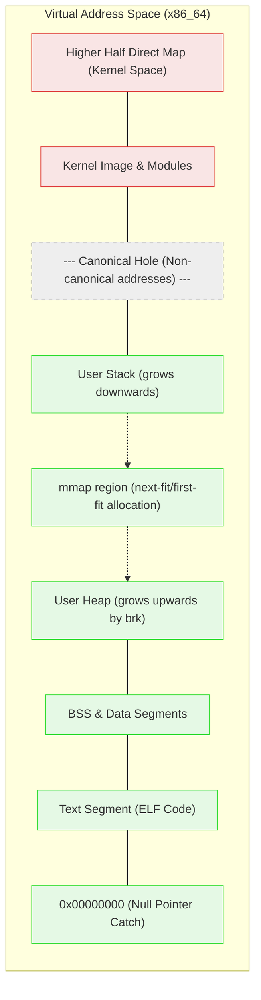

# Orthox-64 Kernel Architecture

このドキュメントは、Orthox-64カーネル（x86_64）の内部構造、設計判断、および実装の前提条件をまとめたものです。
将来的な機能追加やリファクタリング（特に `kernel/syscall.c` や `kernel/task.c` の分割）の際の指針として機能します。

文書更新の運用ルールは `Docs/Internal/Documentation_Process.md` に定義します。kernel 整理や syscall 分割では、実装変更と対応する文書更新を同じ完了条件として扱います。

## 1. Boot Flow (ブートフロー)
カーネルの起動は Limine ブートローダを介して行われます。
1. **Entry Point (`_start` in `kernel/init.c`)**:
   - Limineから渡されたリクエスト（`memmap`, `hhdm`, `kernel_address`, `smp` 等）の応答を確認。
   - シリアルポートの初期化 (`init_serial`)。
2. **Core Subsystem Initialization**:
   - `pmm_init()`: 物理メモリマネージャ（PMM）の初期化。
   - `gdt_init()`, `idt_init()`: GDT、IDTの設定。
   - `enable_sse()`, `enable_paging_features()`: ページングとSSEの有効化。
   - `syscall_init()`: システムコールの初期化 (`MSR_LSTAR` への登録)。
3. **Hardware & Subsystems**:
   - `vmm_init()`: 仮想メモリマネージャ（VMM）の初期化、HHDMおよびカーネル空間のマッピング。
   - PIC, LAPIC, PCI, Sound, FS, Net, USB, VirtIO の各ドライバの初期化。
4. **SMP (Symmetric Multiprocessing)**:
   - `smp_init()` と `smp_start_aps()` によりAP（Application Processor）を起動。
5. **Task & Userland Initialization**:
   - `task_init()` でスケジューラを初期化。
   - Limine モジュールとしてロードされたユーザーランド初期プログラム（`/bin/sh` など）を `elf_load()` により解析。
   - `task_create()` および `task_prepare_initial_user_stack()` によって最初のユーザータスクを構築。
   - `task_idle_loop(1)` または `kernel_yield()` を呼び出して最初のユーザータスクへ移行。

## 2. Task / Scheduler (タスクとスケジューラ)
- **タスク構造体 (`struct task` in `include/task.h`)**:
  - 各タスクは `struct task` で管理されます。
  - レジスタ状態 (`struct task_context`)、プロセス情報 (PID, PPID, PGID)、シグナル状態、ユーザー空間のスタック制限、および `heap_break`、`mmap_end` 等のメモリ管理情報を保持します。
- **スケジューリング**:
  - LAPICタイマー割り込み (`task_on_timer_tick`) を契機とするプリエンプティブ・マルチタスク。
  - `struct cpu_local` により、各CPUコアごとの実行キュー (`runq_head`, `runq_tail`) を管理し、SMP環境での負荷分散を図っています。

### 2.1 Task lifecycle と process syscall の境界

- `kernel/task.c` は task object、run queue、address space、kernel stack、task allocation / reap の実体を所有する。`execve` と initial user stack 構築は `kernel/task_exec.c`、fork の task 複製は `kernel/task_fork.c` が所有する。
- `task_fork()` は `kernel/task_fork.c` で親 task の user address space、signal handler 状態、fd、cwd、TLS 情報を子へ複製し、子を run queue に載せる。
- `task_execve()` は `kernel/task_exec.c` で現在 task の image を置き換え、新しい PML4、user stack、TLS、`argv/envp/auxv`、close-on-exec fd を処理する。旧 address space は `deferred_cr3` 経由で reap 時に解放する。
- `kernel/sys_proc.c` は Linux 互換 process syscall の薄い wrapper を所有する。`wait4`, `exit`, `kill` は `task_mark_zombie()`, `task_reap()`, `task_wake()` と `SIGCHLD` 通知を組み合わせるが、task allocator や address space 複製の実体は持たない。
- `SIGCHLD` は `exit` または fatal signal による zombie 化時に親 task の `sig_pending` bit 20 として通知する。`wait4` は zombie child を見つけたら status を返し、親の pending `SIGCHLD` を消して `task_reap()` する。
- `setpgid`, `getpgrp`, `setsid` と TTY foreground process group helper は `kernel/sys_proc.c` が所有する。TTY termios と ioctl dispatcher はまだ `kernel/syscall.c` に残すが、`TIOCGPGRP` / `TIOCSPGRP` は `sys_tcgetpgrp()` / `sys_tcsetpgrp()` へ委譲する。

## 3. Syscall Dispatch と Trap (トラップ)
Orthox-64 ではシステムコールや例外処理（トラップ）について明確なディスパッチ機構を備えています。

### システムコールフロー
- **エントリーポイント**:
  - `SYSCALL` 命令発行時、`kernel/syscall_entry.S` 内の `syscall_entry` が実行され、ユーザースタックからカーネルスタックへ切り替えます。
- **ディスパッチとハンドラ**:
  - その後 `kernel/syscall.c` 内の C 言語のハンドラへルーティングされ、`SYS_*` マクロ（Linux互換のシステムコール番号、`include/syscall.h` 定義）に基づいて `switch` 分岐されます。
- **リファクタリング計画**:
  - 現状の `kernel/syscall.c` は肥大化しており、VM（メモリ）、プロセス制御、ファイルシステム、シグナル、時間などの処理が混在しています。
  - 将来的には、責務ごとに `sys_vm.c`, `sys_proc.c`, `sys_fs.c`, `sys_signal.c`, `sys_time.c` へ分割する予定です。

<div class="page-break"></div>



### トラップ（例外・ページフォルト）フロー
割り込みや例外（ページフォルト等）が発生した場合は、IDT（Interrupt Descriptor Table）を介して処理されます。とくに COW（Copy-On-Write）におけるページフォルトハンドラのフローは重要です。

<div class="page-break"></div>



## 4. PMM / VMM / User Address Layout
- **PMM (Physical Memory Manager)**:
  - `kernel/pmm.c` で実装され、ページ単位の物理メモリ割り当てと解放を行います。
  - ページごとの参照カウンタ (`pmm_get_ref`) を持ち、後述の COW (Copy-On-Write) の基盤となります。
- **VMM (Virtual Memory Manager)**:
  - 4階層ページテーブル (PML4) を使用。`kernel/vmm.c` がマッピングおよびページフォルトの処理 (`vmm_page_fault_handler`) を担当します。
- **User Address Layout**:
  - 標準的な ELF レイアウトを採用。下位アドレスからテキスト/データ領域、ヒープ（`brk` で拡張）、`mmap` 領域が配置され、高位アドレスからスタックが下方へ伸びます。

<div class="page-break"></div>



## 5. `brk`, `mmap`, `munmap`, `mremap`, COW の仕様
- **`sys_brk`**:
  - `current->heap_break` を管理し、必要に応じてページを確保・解放します。
- **`sys_mmap` / `sys_munmap`**:
  - 以前は `current->mmap_end` を単調増加させる実装でしたが、GCC (`cc1`) 等の頻繁な小さな `mmap`/`munmap` 要求に対処するため、現在は**next-fit（またはfirst-fit）アルゴリズム**によって空き領域（ギャップ）を再利用する仕様になっています。
- **`sys_mprotect`**:
  - `mmap` 領域だけでなく、ELF 本体や dynamic linker の mapped user page にも適用できる。これは musl dynamic linker が `GNU_RELRO` を read-only 化するために必要です。
- **`sys_mremap`**:
  - マッピングのサイズ変更や移動を行います。ページフォルト時の効率化のため、可能なら既存の物理ページを新しい仮想アドレスへ再マップします。
- **COW (Copy-On-Write)**:
  - `fork` 実行時、親タスクのページテーブルエントリ (PTE) を書き込み不可かつ `PTE_COW` フラグ付きに設定して子タスクにコピーします。
  - いずれかのタスクが書き込みを行った際に `#PF` (ページフォルト) が発生。`vmm_page_fault_handler` が `PTE_COW` を検知し、PMMの参照カウンタが複数であれば新しい物理ページを確保してデータをコピーします。

## 6. FS / RetroFS / RAMFS / rootfs の関係
- **VFS (Virtual File System)**:
  - `kernel/fs.c` が抽象化レイヤを提供し、`open`, `read`, `write`, `stat` などのファイルシステムコールを共通化します。
- **RetroFS**:
  - Orthox-64 独自のディスク用ファイルシステム (`kernel/retrofs.c`)。
- **RAMFS**:
  - メモリ上のファイルシステム。ディスクI/Oのボトルネックを排除して `cc1` などの純粋なCPU/メモリ性能を計測するために使用されます。
- **rootfs**:
  - 初期段階では Limine モジュールとしてロードされたイメージ、または VirtIO ブロックデバイス上のイメージがルートファイルシステムとしてマウントされます。

### 6.1 xv6fs self-hosting extension

- Orthox-64 の xv6fs は、元 xv6 の教材用 small file 前提から拡張され、native self-compile 用 rootfs として使用する。
- large file / sparse file / triple-indirect block は Orthox-64 側の拡張であり、allocation / read / write / truncate / unlink / iput / bitmap consistency を一体で検証する。
- `kernel/fs.c` の xv6fs write path は、1 回の user `write()` を `XV6FS_WRITE_CHUNK_MAX` 単位の log transaction に分割する。現在値は 112 KiB。
- 112 KiB は `XV6FS_LOGBLOCKS=126` を前提に、data block、bitmap block、indirect metadata block、inode update が 1 transaction に収まる範囲として設定する。
- `xv6fs_writei()` の file-size 上限判定は 64-bit 計算で行う。`XV6FS_MAXFILE * XV6FS_BSIZE` は 32-bit では wrap し、triple-indirect 開始位置以降を誤って reject するため。
- 対応 smoke は `xv6sparsesmoke`、`xv6reclaimsmoke`、`xv6largewritesmoke`。host 側 `scripts/build_rootfs_xv6fs.py --check rootfs.img` を併用して unreferenced block 0 を確認する。

### 6.2 `/kbuild` persistent cache workflow

`/kbuild` は guest native build の object cache であり、xv6fs の `rootfs.img` を writable VirtIO block device として使う場合だけ永続化される。Limine module として読み込まれた rootfs への guest write は、host 側 `rootfs.img` へ戻らない。

保持される操作:

- `rootfs.img` が既に存在する状態で `ROOTFS_REBUILD=0 make orthos.iso` を実行する。ISO は既存 image を取り込み、`/kbuild/*.o` は保持される。
- `make persist-run`、`make persistsmprun`、`make persistnetrun` は `ROOTFS_REBUILD=0` を使うため、既存 `rootfs.img` を前提に cache を保持する。
- `scripts/build_rootfs_xv6fs.py --replace FS_PATH HOST_FILE rootfs.img` は、既存 regular file の割り当て済み領域を書き換えるだけで inode/block の新規割り当てを行わない。`/etc/bootcmd` や smoke script の短い差し替えに使う。
- `tests/native_kernel_boot_smoke.sh` は `--replace` と `ROOTFS_REBUILD=0` を使い、native build の `/kbuild/*.o` cache を壊さずに bootcmd / script を差し替える。

失われる操作:

- default の `make rootfs.img` または `make orthos.iso` は `ROOTFS_REBUILD=1` で `rootfs.img` を host `rootfs/` tree から再生成する。`rootfs/kbuild` が空なら guest が作った `/kbuild/*.o` と `/kernel.elf` は消える。
- `rootfs.img` を削除、置換、または clean rebuild する。
- host 側 `rootfs/` tree だけを編集しても、既存 `rootfs.img` 内の `/kbuild` は変わらない。次回 rebuild 時の入力になるだけである。
- `--replace` は既存 file を大きくする用途、または新規 file 作成には使わない。割り当て済み容量を超える差し替えは cache 保持手段として扱わない。

推奨手順:

- cache を保持して ISO だけ作り直す: `ROOTFS_REBUILD=0 make orthos.iso`
- bootcmd / smoke script だけ差し替える: `python3 scripts/build_rootfs_xv6fs.py --replace /etc/bootcmd HOST_BOOTCMD rootfs.img`
- cache を意図的に捨てる: `ROOTFS_REBUILD=1 make orthos.iso` または `make rootfs.img`
- 事前/事後確認: `python3 scripts/build_rootfs_xv6fs.py --ls /kbuild rootfs.img` と `python3 scripts/build_rootfs_xv6fs.py --check rootfs.img`

## 7. Userland ABI と musl / native toolchain の前提
- **ABI**:
  - x86_64 SysV ABI に準拠し、システムコール番号および引数の渡し方は Linux 互換として設計されています。
- **Native Toolchain**:
  - 互換性の高さを活かし、`musl libc`、BusyBox、GNU Make、ネイティブ版の GCC (`cc1`), `as`, `ld` が Orthox-64 上で直接動作（セルフホストの基盤構築）する状態になっています。

### 7.1 OS / kernel version
- OS / kernel version は `include/version.h` を source of truth とする。
- 現在の release は `0.3.0`。
- `0.3.0` は、self compile が可能になったことと、kernel 整理 / `syscall.c` 分割が開始・進行していることを反映した release とする。
- kernel boot banner、Limine menu label、`uname` の `release` / `version` はこの version と整合させる。
- `include/syscall.h` の syscall 番号や ABI version とは分離して扱う。OS release を上げても、Linux 互換 syscall ABI を暗黙に変えたことにはしない。
- userland から見える version は、まず `uname` 互換 syscall 経由で公開する。

## 8. Smoke Tests の分類と目的
- **配置**:
  - `tests/` ディレクトリ配下に多数のテストスクリプトが配置されています（例：`native_stage2_userland_smoke.sh`、`native_cc1_ramfs_probe_smoke.sh`）。
- **目的**:
  - 新機能の追加やリファクタリング時に、ユーザーランドの基本機能（プロセス制御、ファイル操作、シェル等）が破損していないかを回帰テストします。
  - また、長時間稼働時や特定の重いワークロード（例: RAMFS 上での `cc1` 実行時の270秒タイムアウト問題の再現など）の性能分析・切り分け用としても活用されます。

## 9. ディレクトリ構造とモジュール規模

カーネルの実装は主に `kernel/` および `include/` ディレクトリに格納されています。主要なファイルの構成と規模（行数）は以下の通りです。

### 9.1 ディレクトリ構造概略

```text
kernel/
├── init.c               # カーネルエントリポイント (_start)
├── task.c               # タスク管理・スケジューリング
├── syscall.c            # システムコールハンドラ（肥大化、要分割）
├── syscall_entry.S      # システムコールエントリアセンブリ
├── vmm.c                # 仮想メモリ管理
├── pmm.c                # 物理メモリ管理
├── fs.c                 # 仮想ファイルシステム (VFS)
├── vfs.c                # VFS補助ルーチン
├── retrofs.c            # 独自のファイルシステム
├── smp.c                # SMP（マルチコア）サポート
├── elf.c                # ELFローダー
├── interrupt.S          # 割り込み・例外ハンドラアセンブリ
├── idt.c                # 割り込み記述子テーブル
├── gdt.c                # グローバル記述子テーブル
├── pic.c, lapic.c       # 割り込みコントローラ
├── pci.c                # PCIバスドライバ
├── usb.c                # USBドライバ
├── net.c, net_socket.c  # ネットワーク・ソケット基盤
├── lwip_port.c          # lwIP移植レイヤ
├── sound.c              # サウンドドライバ
├── virtio.c, virtio_*.c # VirtIOデバイスドライバ
├── keyboard.c           # PS/2キーボードドライバ
└── storage.c            # ブロックストレージ基盤
include/                 # 各種ヘッダファイル群
```

### 9.2 各モジュールの行数（規模）

現状の各主要ソースファイル（Cおよびアセンブリ）の行数です。`fs.c` と `syscall.c`、`usb.c`、`task.c` が全体の大きな割合を占めていることが分かります。

| ファイル名 | 行数 | 責務・概要 |
|:---|---:|:---|
| `kernel/fs.c` | 2,527 | VFSおよび各ファイルシステム操作の統合 |
| `kernel/syscall.c` | 906 | システムコールディスパッチ、共通 trace hook、未分割 syscall 実装 |
| `kernel/usb.c` | 1,626 | USBホストコントローラおよびデバイスドライバ |
| `kernel/task.c` | 788 | task core、run queue primitive、task allocation / reap |
| `kernel/net_socket.c` | 863 | ネットワークソケットの実装 |
| `kernel/retrofs.c` | 693 | 独自ファイルシステム（RetroFS）の実装 |
| `kernel/sound.c` | 490 | サウンドドライバ（AC97等） |
| `kernel/vmm.c` | 471 | ページテーブル操作、ページフォルト、mmap管理 |
| `kernel/lwip_port.c` | 466 | lwIPネットワークスタックの組み込み |
| `kernel/task_exec.c` | 416 | `execve` と initial user stack 構築 |
| `kernel/sys_vm.c` | 387 | user address space と VM syscall |
| `kernel/init.c` | 314 | カーネル初期化、エントリポイント |
| `kernel/pci.c` | 276 | PCIバス列挙および設定 |
| `kernel/sys_proc.c` | 247 | process lifecycle、signal delivery、process group、TTY foreground、PID、TLS、futex、thread 補助 syscall |
| `kernel/smp.c` | 243 | AP起動、プロセッサ間割り込み（IPI） |
| `kernel/virtio_net.c` | 230 | VirtIO ネットワークドライバ |
| `kernel/sys_time.c` | 216 | 時刻、sleep、yield、system info 系 syscall |
| `kernel/idt.c` | 214 | IDTの構築、割り込みルーティング |
| `kernel/keyboard.c` | 195 | PS/2 キーボードドライバ |
| `kernel/pmm.c` | 189 | 物理メモリページのアロケータ |
| `kernel/virtio_blk.c` | 158 | VirtIO ブロックストレージドライバ |
| `kernel/lapic.c` | 144 | Local APIC の制御とタイマー |
| `kernel/elf.c` | 144 | ユーザーランドELFバイナリのロード |
| `kernel/storage.c` | 116 | ストレージデバイスの抽象化 |
| `kernel/interrupt.S` | 106 | 割り込み・例外時のレジスタ保存/復帰 |
| `kernel/task_switch.S` | 102 | コンテキストスイッチ処理 |
| `kernel/task_fork.c` | 100 | fork の task 複製 |
| `kernel/sys_signal.c` | 96 | Linux 互換 signal と Orthox signal wrapper |
| `kernel/vfs.c` | 88 | VFSパス解決やマウント等 |
| `kernel/gdt.c` | 87 | GDTおよびTSSの構築 |
| `kernel/spinlock.c` | 86 | スピンロック（SMP対応同期プリミティブ） |
| `kernel/syscall_entry.S` | 69 | SYSCALLエントリのアセンブリ処理 |
| `kernel/sched.c` | 123 | scheduler policy knob、resched request、timer tick、`schedule()`、idle loop |

## 10. `kernel/syscall.c` 分割計画

`kernel/syscall.c` は現在、SYSCALL エントリから呼ばれる C 側ディスパッチ、Linux 互換 syscall の実装、Orthox private syscall、メモリ調査用 trace、ユーザーコピー補助、各種 Linux 互換構造体定義をまとめて持っている。

セルフコンパイル後の整理では、まず syscall の分類と移動先を固定し、低リスクな syscall から小さく切り出す。初期段階ではディスパッチ本体を `kernel/syscall.c` に残し、各カテゴリの実装だけを別ファイルへ移す。すべての syscall を一度に移動しない。

### 10.1 分割後の基本構成

| ファイル | 役割 | 初期移動候補 |
|:---|:---|:---|
| `kernel/syscall.c` | SYSCALL 初期化、C 側 dispatcher、共通 trace hook、未分類 syscall の一時置き場 | `syscall_init()`, `syscall_init_cpu()`, `syscall_c_handler()` |
| `kernel/sys_time.c` | 時刻、sleep、yield、システム情報 | `clock_gettime`, `gettimeofday`, `nanosleep`, `sched_yield`, `sysinfo`, `uname`, `getrlimit`, `prlimit64`, `ORTH_SYS_SLEEP_MS` |
| `kernel/sys_vm.c` | user address space と VM syscall | `brk`, `mmap`, `munmap`, `mprotect`, `mremap`, `madvise` |
| `kernel/sys_proc.c` | process / task lifecycle、PID、session、thread 補助 | `fork`, `execve`, `exit`, `exit_group`, `wait4`, `getpid`, `getppid`, `getuid`, `getgid`, `geteuid`, `getegid`, `setpgid`, `getpgrp`, `setsid`, `arch_prctl`, `futex`, `set_tid_address`, `set_robust_list` |
| `kernel/sys_signal.c` | Linux 互換 signal と Orthox signal wrapper | `rt_sigaction`, `rt_sigprocmask`, `sigaltstack`, `ORTH_SYS_SIGACTION`, `ORTH_SYS_SIGPROCMASK`, `ORTH_SYS_SIGPENDING`。signal delivery と `kill` は `kernel/sys_proc.c` が所有する |
| `kernel/sys_fs.c` | ファイル、ディレクトリ、fd、pipe、cwd | `read`, `write`, `open`, `openat`, `close`, `stat`, `fstat`, `lstat`, `fstatat`, `access`, `faccessat`, `readlink`, `readlinkat`, `lseek`, `truncate`, `ftruncate`, `getdents`, `getdents64`, `getcwd`, `chdir`, `fchdir`, `mkdir`, `mkdirat`, `rmdir`, `unlink`, `unlinkat`, `rename`, `chmod`, `utimensat`, `sync`, `fcntl`, `ioctl`, `readv`, `writev`, `pipe`, `pipe2`, `dup2` |
| `kernel/sys_net.c` | socket syscall と DNS helper | `socket`, `connect`, `accept`, `sendto`, `recvfrom`, `shutdown`, `bind`, `listen`, `getsockname`, `getpeername`, `setsockopt`, `ORTH_SYS_DNS_LOOKUP` |
| `kernel/sys_device.c` | Orthox private device syscall | framebuffer, keyboard, sound, USB, mount status, CPU/runq stats |

### 10.2 ディスパッチの扱い

最初の段階では `switch (syscall_no)` を `kernel/syscall.c` に残す。理由は、引数レジスタ (`rdi`, `rsi`, `rdx`, `r10`, `r8`, `r9`) から各 syscall へ渡す境界を一箇所に残した方が、移動中の差分が読みやすいため。

各分割ファイルは `sys_*` 関数を提供し、`kernel/syscall.c` はそれを呼ぶだけにする。ディスパッチテーブル化は、関数分割が安定した後の別段階で検討する。

### 10.3 ヘッダ分割

最初に作るヘッダは必要最小限にする。

| ヘッダ | 用途 |
|:---|:---|
| `include/syscall.h` | syscall 番号、Orthox private syscall 番号、userland と共有する ABI 構造体 |
| `include/sys_internal.h` | kernel 内部の `sys_*` prototype、Linux 互換 kernel-only 構造体 |

`include/syscall.h` は userland からも参照されるため、kernel 内部だけで使う構造体や helper prototype を増やしすぎない。Linux 互換の kernel-only 構造体は `sys_internal.h` へ寄せる。

### 10.4 切り出し順序

低リスクで依存が少ないものから切り出す。

1. `sys_time.c`
   - `clock_gettime`, `gettimeofday`, `nanosleep`, `sched_yield`, `uname`, `sysinfo`, resource limit 系、`sleep_ms` を移す。
   - FS、VM、task の深い状態変更が少なく、最初の分割に向く。
   - 現状: 実施済み。dispatcher は `kernel/syscall.c` に残し、実装は `kernel/sys_time.c` が所有する。
2. `sys_signal.c`
   - Linux 互換 `rt_sigaction` / `rt_sigprocmask` と Orthox private signal wrapper を集約する。
   - `task.c` の signal 状態との境界を確認する。
   - 現状: `sigaction` / `sigprocmask` / `sigpending` / `sigaltstack` 系は実施済み。`kill` と delivery helper は `kernel/sys_proc.c` へ移動済み。
3. `sys_vm.c`
   - `brk`, `mmap`, `munmap`, `mprotect`, `mremap`, `madvise` を移す。
   - `cc1` 長時間問題の調査対象なので、trace と counter の位置を崩さない。
   - 現状: 実施済み。VM syscall 実装と VM helper は `kernel/sys_vm.c` が所有する。dispatcher と `ORTHOX_MEM_PROGRESS` counter、`mmap` 系 memtrace 呼び出しは `kernel/syscall.c` に残す。
4. `sys_proc.c`
   - `fork`, `execve`, `wait4`, `exit`, PID/session/futex/thread 補助を移す。
   - `task.c` との循環依存が出やすいため、VM 分割後に行う。
   - 現状: 部分実施済み。`getpid` / `getppid` / UID/GID stub、`arch_prctl`, `futex`, `set_tid_address`, `set_robust_list`, `wait4`, `exit`, `kill`、signal delivery helper、`setpgid`, `getpgrp`, `setsid`, `tcgetpgrp`, `tcsetpgrp`, TTY foreground process group helper は `kernel/sys_proc.c` が所有する。`fork`, `execve` は `task.c` 実装を dispatcher から直接呼ぶ。termios と ioctl dispatcher は `kernel/syscall.c` に残す。
5. `sys_fs.c`
   - syscall 数が多く、`fs.c` との関係も大きいため後半で行う。
   - 最初は単純な fd syscall から移し、pipe / cwd / dirent / path mutation は段階的に移す。
6. `sys_net.c` と `sys_device.c`
   - socket 群と Orthox private device syscall を最後に整理する。
   - private syscall は userland ABI への影響が大きいため、番号と構造体を変えない。

### 10.5 検証単位

各段階で最低限、以下を確認する。

| 分割対象 | 主な確認 |
|:---|:---|
| `sys_time.c` | `make kernel.elf`, `tests/time_syscall_smoke.sh` |
| `sys_signal.c` | `tests/signal_syscall_smoke.sh`, 必要なら `musl_forkexecwait_smoke.sh` |
| `sys_vm.c` | `vm_syscall_smoke.sh`, Python smoke, `native_cc1_ramfs_probe_smoke.sh` |
| `sys_proc.c` | fork / exec / wait smoke、native toolchain smoke |
| `sys_fs.c` | RetroFS smoke、RW smoke、BusyBox / musl file syscall smoke |
| `sys_net.c` | socket / DNS / lwIP を使う smoke |
| `sys_device.c` | framebuffer、keyboard、sound、USB 関連 smoke |

大きな分割のたびに `make kernel.elf` だけで済ませず、QEMU smoke を最低 1 本実行する。長時間 smoke は必要な段階だけに限定し、通常は短い smoke で ABI 破損を先に検出する。

### 10.6 注意点

- `syscall_entry.S` と `struct syscall_frame` の ABI は分割中に変更しない。
- Linux 互換 syscall 番号と Orthox private syscall 番号は変更しない。
- `ORTHOX_MEM_TRACE` と `ORTHOX_MEM_PROGRESS` は、`cc1` 調査で使うため、VM syscall の移動時に消さない。
- `kernel_lock_enter()` / `kernel_lock_exit()` の粒度は、最初の分割では変更しない。
- `syscall.c` から別ファイルへ移した関数は、まず挙動を完全に同じに保つ。整理や最適化は分割後に別コミット相当の粒度で行う。

### 10.7 musl libc 互換性

`kernel/syscall.c` の Linux 互換 syscall は、musl libc、BusyBox、GNU make、GCC wrapper、`cc1/as/ld`、Python などの userland が直接依存する ABI である。分割は kernel 内部の整理であり、musl から見える syscall ABI を変える作業ではない。

分割中に守るべき互換性は以下。

| 項目 | 方針 |
|:---|:---|
| syscall 番号 | `include/syscall.h` の `SYS_*` は Linux x86_64 互換として固定する。番号の変更、再利用、Orthox private syscall との混在は禁止。 |
| 引数 ABI | `rax` に syscall 番号、`rdi`, `rsi`, `rdx`, `r10`, `r8`, `r9` に引数を置く Linux x86_64 syscall ABI を維持する。 |
| 戻り値 | 失敗時は負の `-errno` を返す。musl はこの値を libc 側で `errno` に変換するため、成功/失敗の符号規約を変えない。 |
| `EFAULT` 相当 | user pointer を扱う syscall は、分割後も不正 pointer で kernel panic しないことを目標にする。既存挙動を変える場合は syscall ごとに smoke を追加してから行う。 |
| private syscall | `ORTH_SYS_*` は Linux syscall 番号空間と分離したままにする。musl が直接呼ぶものではなく、Orthox 独自 userland 用 API として扱う。 |

musl 依存が強い syscall 群は以下。

| 分類 | syscall | musl / userland との関係 |
|:---|:---|:---|
| VM / allocator | `brk`, `mmap`, `munmap`, `mprotect`, `mremap`, `madvise` | musl allocator、Python、`cc1` の大きなメモリ確保に直結する。`cc1` 長時間問題の観測対象でもある。 |
| TLS / thread / lock | `arch_prctl`, `set_tid_address`, `set_robust_list`, `futex` | musl の TLS、thread、lock 実装の基盤。pthread の利用範囲が小さくても ABI として壊さない。 |
| signal | `rt_sigaction`, `rt_sigprocmask`, `sigaltstack`, `kill` | musl の signal wrapper が使う。`sigprocmask` の `how` は Linux/musl の `SIG_BLOCK=0`, `SIG_UNBLOCK=1`, `SIG_SETMASK=2` に合わせる。Orthox private signal syscall と Linux 互換 syscall を混同しない。 |
| time | `clock_gettime`, `gettimeofday`, `nanosleep` | `time`, `sleep`, `clock` 系 API の基盤。比較的分割しやすいが戻り値と構造体 layout は固定する。 |
| process | `fork`, `execve`, `exit`, `exit_group`, `wait4`, `getpid`, `getppid`, `setpgid`, `getpgrp`, `setsid` | shell、BusyBox、make、toolchain 実行に直結する。`task.c` との境界変更は慎重に行う。 |
| FS / fd | `read`, `write`, `open`, `openat`, `close`, `stat`, `fstat`, `fstatat`, `getdents64`, `fcntl`, `ioctl`, `pipe`, `pipe2`, `dup2` | musl stdio、BusyBox、make、Python の入出力とプロセス起動に広く使われる。 |

`pread64` / `pwrite64` は Linux syscall number 17 / 18 として扱う。
offset 引数は Linux x86_64 syscall ABI に従い `r10` から受け取る。
通常の `read` / `write` と異なり、成功時も失敗時も fd の current offset を変更しない。
negative offset は `-EINVAL` を返す。これは userland の通常エラーであり、ASSERT / panic 対象ではない。

分割後の検証では、単に `make kernel.elf` が通るだけでは不十分。musl 互換性を守るため、少なくとも以下を段階に応じて実行する。

| 対象 | 優先 smoke |
|:---|:---|
| VM syscall 変更 | `tests/vm_syscall_smoke.sh`, `tests/retrofs_python_smoke.sh`, `tests/native_cc1_ramfs_probe_smoke.sh` |
| process / signal 変更 | `tests/musl_forkexecwait_smoke.sh`, `tests/musl_forkprobe_smoke.sh`, `tests/musl_execprobe_smoke.sh` |
| FS / fd 変更 | `tests/musl_busybox_smoke.sh`, `tests/musl_retrofs_smoke.sh`, `tests/retrofs_rw_smoke.sh` |
| time / misc 変更 | `tests/time_syscall_smoke.sh` |
| toolchain 影響確認 | `tests/native_toolchain_smoke.sh` 系、必要に応じて `tests/native_rebuild_gcc_smoke.sh` 系 |

特に `sys_vm.c` と `sys_proc.c` の分割は musl の基盤を触るため、関数移動と挙動変更を同時に行わない。分割直後は既存の挙動を保ち、その後に性能改善や仕様整理を別段階で行う。

### 10.8 ASSERT / panic policy

kernel 共通の ASSERT / panic 基盤を導入する前に、panic してよい条件と userland へ `-errno` で返す条件を分離する。

基本方針:

- ASSERT は kernel 内部不変条件の破損検出に限定する。
- syscall 引数、user pointer、path、fd 番号、存在しない file、権限、容量不足など userland 由来の通常エラーでは panic しない。
- userland 由来の失敗は Linux 互換 syscall ABI に従い、負の `-errno` を返す。musl は libc 側で `errno` に変換するため、この規約を壊さない。
- metadata 破損、lock ownership 破損、run queue 破損、page table invariant 破損、refcount underflow、log transaction 外の log write など、復旧不能な kernel 内部矛盾だけを ASSERT / panic 対象にする。
- `KASSERT()` は「ここが壊れていたら kernel bug」と言える条件に使う。外部入力の validation shortcut として使ってはならない。
- `KBUG_ON()` または panic は、処理継続すると disk / memory / scheduler state をさらに壊す可能性が高い条件に限定する。
- ASSERT 追加時は、invalid user input smoke が panic せず errno で戻ることを先に確認する。

判断表:

| 条件 | 返し方 |
|:---|:---|
| bad fd、missing path、invalid flag、negative offset、unsupported syscall | `-EBADF` / `-ENOENT` / `-EINVAL` / `-ENOSYS` など |
| user pointer が読めない、書けない | `-EFAULT` 相当。未対応箇所は panic 化せず、個別に smoke を追加してから改善する |
| file size limit、disk full、resource exhaustion | `-EFBIG` / `-ENOSPC` / `-ENOMEM` など |
| inode type と fd type の内部不整合 | ASSERT / panic 候補 |
| xv6log transaction 外の `xv6log_write()`、log header overflow | ASSERT / panic 候補 |
| run queue link、task state、COW refcount、page table ownership の内部矛盾 | ASSERT / panic 候補 |

Rank 5 時点の検証 smoke は `tests/vm_syscall_smoke.sh` を使う。`user/vmerrno_test.c` は missing path、bad fd `mmap`、unmapped `mprotect`、unsupported syscall などを errno で確認する。

Rank 6 で kernel 共通の ASSERT / panic 基盤を追加した。

- 公開 header は `include/kassert.h`。
- 実装は `kernel/kassert.c`。
- `KASSERT(expr)` は false のとき `kernel_panic(__FILE__, __LINE__, __func__, #expr)` を呼ぶ。
- `KBUG_ON(cond)` は true のとき `kernel_panic()` を呼ぶ。
- `kernel_panic()` は serial に `*** KERNEL PANIC ***`、expression、function、file、line を出力し、interrupt を止めて `hlt` loop に入る。
- 通常 build では selftest は無効。`KERNEL_CFLAGS_EXTRA=-DORTHOX_KASSERT_SELFTEST` で build した場合だけ boot 直後に意図的な `KASSERT(0 && "ORTHOX_KASSERT_SELFTEST")` を発火させ、panic 出力を確認できる。
- Rank 6 時点では ASSERT を既存 subsystem の通常 path へ広く挿入しない。xv6fs / xv6log などへの適用は Rank 7 以降で、Rank 5 の policy に従って内部 invariant に限定する。
- Rank 7 で `kernel/xv6fs.c`、`kernel/xv6log.c`、`kernel/xv6bio.c` の既存 panic 相当を `KASSERT()` へ移行した。対象は bfree double-free、inode cache exhaustion、bad inode lock/unlock、inode type 0、bmap out of range、dirlink read short、log header size、log committing contradiction、transaction overflow、transaction outside write、buffer cache exhaustion などの内部 invariant に限定する。
- Rank 7 では syscall 引数、path lookup failure、disk full、missing file など userland / environment 由来の通常エラーは ASSERT 化していない。
- Rank 7 の確認 smoke は `xv6sparsesmoke`、`xv6reclaimsmoke`、`xv6largewritesmoke`。native kernel boot smoke は長時間のため Rank 9 の標準検証統合で扱う。
- Rank 11 で `kernel/fs.c` の VFS / fd 境界に `fs_assert_open_file_consistent()` と `fs_fd_data_required()` を追加した。
- Rank 11 の ASSERT 対象は、open fd の shared `fs_file_t` refcount、descriptor type と file type の一致、pipe / socket / xv6fs / dir data pointer の non-null など、kernel が作った fd object の内部整合性に限定する。
- Rank 11 でも bad fd、missing path、RAMFS unlink 済み path、capacity error など userland / environment 由来の通常エラーは panic 化しない。
- Rank 12 で `kernel/vmm.c`、`kernel/task.c`、`kernel/task_fork.c` の VM / task 境界に ASSERT を追加した。
- Rank 12 の ASSERT 対象は、page table pointer non-null、page-aligned physical address、user PML4 と kernel PML4 の取り違え、COW page refcount > 0、run queue 上 task の state、reap 対象 task の kernel stack / CR3 alignment などの内部 invariant に限定する。
- `task_fork()` は child を run queue に載せる前に COW PML4 copy、kernel stack allocation、fd clone を完了する。allocation failure は panic ではなく rollback して `-1` を返す。
- Rank 12 の確認は `ROOTFS_REBUILD=0` と `--replace` で `/etc/bootcmd` だけを差し替え、`muslforkprobe:ok`、`status=42`、host `--check rootfs.img` を確認した。
- Rank 13 で `kernel/virtio.c`、`kernel/virtio_blk.c`、`kernel/virtio_net.c` の VirtIO / storage 境界に ASSERT を追加した。
- Rank 13 の ASSERT 対象は、virtqueue layout、descriptor ring pointer、descriptor id 範囲、block request context の ownership、DMA buffer physical address alignment、RX/TX descriptor id と queue size の整合性に限定する。
- VirtIO device 未検出、request timeout、I/O status failure、TX busy、invalid send length など device / environment / caller 由来の通常失敗は ASSERT 化しない。
- Rank 13 の確認は `virtio_blk_inflight_smoke.sh` と `virtio_net_irq_smoke.sh`。net smoke は host UDP socket を使うため sandbox 外で実行した。
- Rank 14 で ASSERT build policy を決めた。default build は `ORTHOX_ENABLE_ASSERTS=1` として `KASSERT()` を有効にする。
- `KERNEL_CFLAGS_EXTRA=-DORTHOX_ENABLE_ASSERTS=0` を指定した build では `KASSERT(expr)` は式を評価しない no-op になる。性能比較や release image 評価用であり、通常開発では使わない。
- `KBUG_ON(cond)` は `ORTHOX_ENABLE_ASSERTS=0` でも常時有効とする。処理継続が危険な kernel bug 検出を release build で消さないため。
- `ORTHOX_KASSERT_SELFTEST` は panic 出力確認専用で、通常 build では無効のままにする。

### 10.9 分割進捗

| 日付 | 分割対象 | 変更内容 | ABI 影響 | 確認 |
|:---|:---|:---|:---|:---|
| 2026-04-29 | `sys_time.c` | `clock_gettime`, `gettimeofday`, `nanosleep`, `sched_yield`, `uname`, `getrlimit`, `prlimit64`, `sysinfo`, `sleep_ms` を `kernel/syscall.c` から移動。`include/sys_internal.h` を追加し、kernel 内部 syscall prototype と kernel-only 構造体を配置。`tests/time_syscall_smoke.sh` と `make timesyscallsmoke` を追加。 | syscall 番号、引数 ABI、`-errno` 規約は変更なし。dispatcher は `kernel/syscall.c` に維持。 | `make kernel.elf` PASS。`bash tests/time_syscall_smoke.sh orthos.iso` PASS。 |
| 2026-04-29 | `sys_signal.c` | `sigaltstack`, `sigprocmask`, `rt_sigprocmask`, `sigpending`, `sigaction`, `rt_sigaction` を `kernel/syscall.c` から移動。`linux_stack_t_k` と `linux_rt_sigaction_k` を `include/sys_internal.h` へ移動。`tests/signal_syscall_smoke.sh` と `make signalsyscallsmoke` を追加。signal delivery と `kill` は `kernel/sys_proc.c` が所有する。 | syscall 番号、引数 ABI、`-errno` 規約は変更なし。`sigprocmask` の `how` 解釈は Linux/musl ABI に合わせ、`SIG_BLOCK=0`, `SIG_UNBLOCK=1`, `SIG_SETMASK=2` とする。dispatcher は `kernel/syscall.c` に維持。 | `make kernel.elf` PASS。`bash tests/signal_syscall_smoke.sh orthos.iso` PASS。 |
| 2026-04-29 | `sys_vm.c` | `brk`, `mmap`, `munmap`, `mprotect`, `mremap`, `madvise` と VM helper を `kernel/syscall.c` から移動。`kernel/sys_vm.c` を追加し、`include/sys_internal.h` に VM syscall prototype を追加。`ORTHOX_MEM_PROGRESS` counter と `mmap` 系 memtrace 呼び出しは dispatcher 側に維持。 | syscall 番号、引数 ABI、`-errno` 規約は変更なし。VM address layout、`mmap_end`、next-fit gap reuse、COW/page table helper の挙動変更なし。 | `make kernel.elf` PASS。`bash tests/vm_syscall_smoke.sh orthos.iso` PASS。 |
| 2026-04-29 | `sys_proc.c` | `getpid`, `getppid`, `getuid`, `getgid`, `geteuid`, `getegid`, `arch_prctl`, `futex`, `set_tid_address`, `set_robust_list`, `wait4`, `exit`, `kill`、signal delivery helper、`setpgid`, `getpgrp`, `setsid`, `tcgetpgrp`, `tcsetpgrp`, TTY foreground process group helper を `kernel/syscall.c` から移動。`kernel/sys_proc.c` を追加し、`include/sys_internal.h` に process syscall prototype を追加。`tests/signal_syscall_smoke.sh` に `signaltest.elf` を追加し、process group / `kill` / `wait` / `exit` も確認対象にした。 | syscall 番号、引数 ABI、`-errno` 規約は変更なし。`arch_prctl` の FS base MSR 更新、futex stub、thread id return、`SIGCHLD` pending、zombie reap、process group、TTY foreground process group の挙動変更なし。`fork/exec` は `task.c` 実装を dispatcher から直接呼ぶ。termios と ioctl dispatcher は `kernel/syscall.c` に残す。 | `make kernel.elf` PASS。`bash tests/musl_forkprobe_smoke.sh orthos.iso` PASS。`bash tests/signal_syscall_smoke.sh orthos.iso` PASS。 |

## 11. `kernel/task.c` 分割計画

`kernel/task.c` は元々 scheduler、per-CPU run queue、task lifecycle、initial user stack、`fork`、`execve` をまとめて持っていた。現在は `execve` を `kernel/task_exec.c`、`fork` を `kernel/task_fork.c` へ切り出し、`kernel/task.c` は task core、run queue、scheduler、task allocation / reap を主に所有する。`syscall.c` 分割後に残る大きな結合点は scheduler と task lifecycle であり、ここを不用意に動かすと musl、BusyBox、shell、native toolchain の実行経路を壊しやすい。

`task.c` 分割は syscall ABI を変える作業ではない。`SYS_FORK`, `SYS_EXECVE`, `SYS_WAIT4`, `SYS_EXIT`, signal 関連 syscall の番号、引数、戻り値規約は固定し、分割中は関数移動と挙動変更を同時に行わない。

### 11.1 現在の責務

| 領域 | 現在の所有 | 主な関数 / 状態 |
|:---|:---|:---|
| per-CPU state | `kernel/task.c` | `g_cpu_locals`, `this_cpu()`, `get_cpu_local*()`, `task_bind_cpu_local()`, `task_install_cpu_local()` |
| run queue / scheduler | `kernel/task.c` + `kernel/sched.c` | `task_runq_*`, `task_mark_ready_on_cpu*`, `task_mark_sleeping*`, `task_wake*` は `kernel/task.c`。fork spread policy knob、resched request、timer tick、`schedule()`、idle loop は `kernel/sched.c` |
| task allocation / reap | `kernel/task.c` | `alloc_task_struct()`, `free_task_struct()`, `task_create*()`, `task_reap*()`, kernel stack と PML4 解放 |
| initial user stack | `kernel/task_exec.c` | `alloc_user_stack()`, `task_prepare_initial_user_stack()`, auxv / argv / envp 配置 |
| exec lifecycle | `kernel/task_exec.c` | `task_execve()`, ELF load、新 PML4、TLS、close-on-exec、FS base、旧 CR3 defer |
| fork lifecycle | `kernel/task_fork.c` | `task_fork()`, COW PML4 copy、fd clone、signal handler copy、child syscall frame |
| process syscall wrapper | `kernel/sys_proc.c` | `wait4`, `exit`, `kill`, PID/session/process group、TTY foreground pgrp helper |

### 11.2 分割後の候補構成

| ファイル | 役割 | 初期移動候補 |
|:---|:---|:---|
| `kernel/task.c` | task core、public API、task list、PID allocation、task allocation / free、状態遷移の入口 | `task_init()`, `task_create*()`, `task_mark_*()`, `task_reap()`, `get_current_task()` |
| `kernel/sched.c` | per-CPU run queue、load balancing、timer tick、context switch policy | `task_runq_*`, `task_on_timer_tick()`, `schedule()`, CPU affinity / fork spread helper |
| `kernel/task_exec.c` | exec image replacement と initial user stack 構築 | `task_prepare_initial_user_stack()`, `task_execve()`, exec copy buffer、auxv/argv/envp stack helper |
| `kernel/task_fork.c` | fork の task 複製 | `task_fork()`, syscall frame copy、fd clone、COW PML4 copy、child kernel stack setup |
| `kernel/task_internal.h` | task subsystem 内部 helper prototype と shared constants | `USER_STACK_*`, `TASK_TIMESLICE_TICKS`, internal locked helper prototype |

最初の分割では `struct task` と `struct cpu_local` は `include/task.h` に残す。外部 module が参照しているため、構造体の visibility 変更は別段階にする。

### 11.3 切り出し順序

1. `task_internal.h` を追加する。
   - `task.c` 内部だけで共有する prototype と constant を置く。
   - public ABI ではないため、userland 共有の `include/syscall.h` には入れない。
   - 現状: 実施済み。`struct syscall_frame`、`TASK_TIMESLICE_TICKS`、`USER_STACK_*`、`MSR_*`、`task_set_comm_from_path()` prototype を置く。
2. `task_exec.c` を切り出す。
   - `task_prepare_initial_user_stack()` と `task_execve()` を移す。
   - `task_set_comm_from_path()`、memtrace / memprogress 初期化、FS close-on-exec、FS base MSR 更新との境界を明確にする。
   - `execve` は現在 task を置き換えるため、失敗時に旧 address space と fd state を壊さないことを確認する。
   - 現状: 実施済み。`execve` の syscall ABI、argv/envp/auxv layout、TLS、close-on-exec、FS base reset、signal handler reset の挙動は変更しない。
3. `task_fork.c` を切り出す。
   - `task_fork()` を移す。
   - child PID、PPID、PGID/SID、signal handler copy、fd clone、COW PML4 copy、child syscall frame の責務を維持する。
   - 失敗時 rollback は分割前と同じ順序を保つ。
   - 現状: 実施済み。`task_fork()` は `kernel/task_fork.c` が所有し、PID 採番、task allocation、fork 用 CPU 選択、ready 化、rebalance、task lock は `kernel/task_internal.h` 経由の thin internal API で `kernel/task.c` に委譲する。
4. `sched.c` を切り出す。
   - run queue と scheduler policy を移す。
   - SMP resched IPI、kernel lock、timer tick sleep wakeup と絡むため、`fork/exec` より後に行う。
   - 現状: `task_set_fork_spread()` / `task_get_fork_spread()`、`g_fork_spread_enabled`、`task_request_resched()`, `task_request_resched_cpu()`, `task_consume_resched()`, `task_idle_loop()`, `task_on_timer_tick()`, `schedule()` を `kernel/sched.c` へ移動した。run queue primitive と task state transition helper は、task lifecycle / reap と lock ownership の結合が強いため `kernel/task.c` に残す。

`task_reap()` は当面 `task.c` に残す。`sys_proc.c` の `wait4` と `exit` が依存し、address space / kernel stack / task struct 解放の所有者でもあるため、reap の移動は最後に扱う。

### 11.4 変更禁止事項

- `struct syscall_frame` と syscall entry ABI は変更しない。
- `task_fork()` / `task_execve()` の syscall 戻り値は変更しない。
- `fork` 時の COW PML4 copy、fd clone、signal handler copy、PGID/SID 継承の挙動は変更しない。
- `execve` 時の argv/envp/auxv layout、TLS 情報、close-on-exec、FS base reset、signal handler reset の挙動は変更しない。
- `task_reap()` による `deferred_cr3`、current CR3、kernel stack、task struct 解放順序を変更しない。
- scheduler の lock 粒度、run queue insertion/removal、resched IPI のタイミングを分割と同時に変えない。

### 11.5 検証単位

| 変更対象 | 必須確認 |
|:---|:---|
| `task_exec.c` | `make kernel.elf`, `tests/musl_execprobe_smoke.sh`, 可能なら `tests/musl_forkexecwait_smoke.sh` |
| `task_fork.c` | `make kernel.elf`, `tests/musl_forkprobe_smoke.sh`, `tests/musl_forkexecwait_smoke.sh` |
| `sched.c` | `make kernel.elf`, `tests/smp_smoke` 系、`tests/musl_forkprobe_smoke.sh`, pipe/wait 系 smoke |
| `task_reap` 変更 | `tests/signal_syscall_smoke.sh`, `tests/musl_forkexecwait_smoke.sh`, zombie/reap 系 smoke |
| native toolchain 影響確認 | 短い fork/exec smoke 後、必要に応じて native toolchain smoke |

`task.c` 分割では、短い QEMU smoke が通るまでは native rebuild 系の長時間 smoke に進まない。まず `fork`, `execve`, `wait4`, signal termination, shell command execution の基本経路を確認する。

### 11.6 分割進捗

| 日付 | 分割対象 | 変更内容 | ABI 影響 | 確認 |
|:---|:---|:---|:---|:---|
| 2026-04-29 | `task_exec.c` | `kernel/task_internal.h` を追加し、`task_prepare_initial_user_stack()`、`task_execve()`、exec copy buffer、argv/envp copy helper、auxv stack helper を `kernel/task.c` から `kernel/task_exec.c` へ移動。`task_set_comm_from_path()` は task core 側 helper として external 化した。 | syscall 番号、引数 ABI、`-errno` 規約は変更なし。`execve` の argv/envp/auxv layout、TLS、close-on-exec、FS base reset、signal handler reset、旧 CR3 defer の挙動変更なし。 | `make kernel.elf` PASS。`bash tests/musl_execprobe_smoke.sh orthos.iso` PASS。`bash tests/musl_forkexecwait_smoke.sh orthos.iso` PASS。 |
| 2026-04-29 | `task_fork.c` | `task_fork()` を `kernel/task.c` から `kernel/task_fork.c` へ移動。`kernel/task_internal.h` に fork が必要とする task lock、PID 採番、task allocation/free、fork 用 CPU 選択、ready 化、rebalance の thin internal API を追加。 | syscall 番号、引数 ABI、`-errno` 規約は変更なし。COW PML4 copy、fd clone、signal handler copy、PGID/SID 継承、child syscall frame、failure rollback の挙動変更なし。 | `make kernel.elf` PASS。`bash tests/musl_forkprobe_smoke.sh orthos.iso` PASS。`bash tests/musl_forkexecwait_smoke.sh orthos.iso` PASS。 |
| 2026-04-29 | `sched.c` | `task_set_fork_spread()` / `task_get_fork_spread()` と `g_fork_spread_enabled` を `kernel/task.c` から `kernel/sched.c` へ移動。`task_choose_fork_cpu_locked()` は `task_get_fork_spread()` 経由で policy knob を参照する。 | syscall 番号、引数 ABI、`-errno` 規約は変更なし。fork spread の default enabled と CPU 選択挙動は変更なし。run queue、timer tick、`schedule()` は未移動。 | `make kernel.elf` PASS。`bash tests/musl_forkprobe_smoke.sh orthos.iso` PASS。 |
| 2026-04-29 | `sched.c` | `task_request_resched()`, `task_request_resched_cpu()`, `task_consume_resched()`, `task_idle_loop()` を `kernel/task.c` から `kernel/sched.c` へ移動。`kernel/task.c` は `task_this_cpu()` を internal helper として提供する。 | syscall 番号、引数 ABI、`-errno` 規約は変更なし。resched pending flag、resched IPI 発行条件、idle loop の `net_poll()` / `hlt` / `kernel_yield()` の挙動変更なし。run queue、timer tick、`schedule()` は未移動。 | `make kernel.elf` PASS。`bash tests/musl_forkprobe_smoke.sh orthos.iso` PASS。 |
| 2026-04-29 | `sched.c` | `task_on_timer_tick()` を `kernel/task.c` から `kernel/sched.c` へ移動。`kernel/task.c` は `task_wake_locked_internal()` と `task_trace_progress_tick_internal()` を internal helper として提供する。 | syscall 番号、引数 ABI、`-errno` 規約は変更なし。sleeping task wakeup、timeslice decrement、resched request、memprogress trace の挙動変更なし。run queue と `schedule()` は未移動。 | `make kernel.elf` PASS。`bash tests/musl_forkprobe_smoke.sh orthos.iso` PASS。`bash tests/time_syscall_smoke.sh orthos.iso` PASS。 |
| 2026-04-29 | `sched.c` | `schedule()` を `kernel/task.c` から `kernel/sched.c` へ移動。`kernel/task.c` は `task_runq_pop_locked_internal()`, `task_is_idle_task_internal()`, `task_refresh_cpu_local_msrs_internal()`, `task_write_user_fs_base_internal()` を internal helper として提供する。 | syscall 番号、引数 ABI、`-errno` 規約は変更なし。context switch 前の run queue pop、前 task の ready 再投入、TSS stack 更新、per-CPU GS/KERNEL_GS refresh、user FS base restore の順序変更なし。run queue primitive は task lifecycle と lock ownership のため `kernel/task.c` に維持。 | `make kernel.elf` PASS。`bash tests/musl_forkprobe_smoke.sh orthos.iso` PASS。`bash tests/musl_forkexecwait_smoke.sh orthos.iso` PASS。`bash tests/time_syscall_smoke.sh orthos.iso` PASS。 |

---

## 12. カーネル完成度評価（2026-04-29）

本セクションは Kernel.md 全体のレビューに基づき、Orthox-64 の現時点での完成度を記録する。

### 12.1 実装済みコンポーネント

| 層 | コンポーネント | 状態 |
|:---|:---|:---|
| ブート | Limine, PMM, GDT, IDT, SSE, ページング有効化 | ✅ 完成 |
| メモリ管理 | PMM + VMM（HHDM/カーネル空間）, mmap/munmap/mprotect/mremap/brk, COW | ✅ 完成 |
| 割り込み・例外 | IDT, LAPIC, PIC, COW ページフォルトハンドラ | ✅ 完成 |
| システムコール | `SYSCALL` MSR, Linux 互換 ABI, ディスパッチャ | ✅ 完成 |
| sys_time | `clock_gettime`, `gettimeofday`, `nanosleep` 等 | ✅ 完成 |
| sys_signal | `sigaction`, `sigprocmask`, `sigpending` 等 | ✅ 完成 |
| sys_vm | `brk`, `mmap`, `munmap`, `mprotect`, `mremap`, `madvise` | ✅ 完成 |
| sys_proc | `getpid/ppid`, `wait4`, `exit`, `kill`, `fork`, `exec`, `futex`, `setpgid`, `setsid` 等 | ✅ 完成 |
| タスク管理 | `task_create`, `task_reap`, PID 管理, zombie/reap, SIGCHLD | ✅ 完成 |
| スケジューラ | プリエンプティブ, SMP per-CPU runq, fork spread, resched IPI | ✅ 完成 |
| fork | COW PML4 copy, fd clone, signal handler copy | ✅ 完成 |
| exec | ELF load, argv/envp/auxv, TLS, close-on-exec, deferred CR3, `PT_INTERP` dynamic linker handoff, `/lib/ld-musl-x86_64.so.1` dynamic binary smoke, `dlopen` / `dlsym` smoke, dynamic BusyBox applet (`echo/cat/ls/wc/test -f`) / `busybox.dyn ash` / `gcc.dyn` wrapper smoke | ✅ 完成 |
| シグナル | delivery, pending bitmap, signal handler, SIGCHLD | ✅ 完成 |
| VirtIO Block/Net | 動作確認済み（ポーリング方式） | ⚠️ 効率化が残課題 |
| ファイルシステム | retrofs, VFS 同期インターフェース | ✅ 完成 |
| ユーザーランド | `/bin/sh` 起動, musl libc, BusyBox, native toolchain, dynamic BusyBox applets, dynamic BusyBox ash, dynamic GCC wrapper | ✅ 完成 |

### 12.2 残課題

| 項目 | 状況 |
|:---|:---|
| Interrupt-driven I/O | 計画策定済み（`InterruptIO_Plan_v2.md` 参照）、未実装 |
| MSI-X / PCI 割り込み | 未実装 |
| `syscall.c` 残余分割 | termios, ioctl dispatcher が `kernel/syscall.c` に残存 |
| `task_reap()` 移動 | `wait4`/`exit` との結合が強いため意図的に保留 |

### 12.3 総合評価

**完成度: 約 75〜80%**

POSIX 互換 syscall・fork/exec・COW・SMP・musl + BusyBox + native toolchain が動作しており、
趣味 OS としては頂点に近いレベルに達している。残課題は機能的な欠落ではなく、
I/O 効率化と内部構造の仕上げであり、Interrupt-driven I/O の完成をもって
実用レベルの OS として十分成立する段階に入っている。

---

## 13. Interrupt-driven I/O 待機基盤

`Docs/Internal/InterruptIO_Plan.md` のフェーズ1として、I/O 完了待ちに使う最小の待機基盤を追加した。

| 領域 | 所有ファイル | 状態 |
|:---|:---|:---|
| wait queue API | `include/wait.h`, `kernel/wait.c` | `wait_queue_init()`, `wait_event()`, `wait_event_timeout()`, `wake_up_one()`, `wake_up_all()` を提供 |
| completion API | `include/wait.h`, `kernel/wait.c` | `init_completion()`, `complete()`, `complete_all()`, `wait_for_completion()`, `wait_for_completion_timeout_status()` を提供 |
| bottom half API | `include/bottom_half.h`, `kernel/bottom_half.c` | IRQ handler から deferred work を queue し、`task_idle_loop()` で実行 |
| legacy IRQ dispatch | `include/irq.h`, `kernel/irq.c`, `kernel/idt.c` | PIC IRQ 0-15 の handler registration と dispatch を提供 |
| MSI/MSI-X vector dispatch | `include/irq.h`, `kernel/irq.c`, `kernel/idt.c`, `kernel/interrupt.S` | IDT vector 49-63 の handler registration と LAPIC EOI dispatch を提供 |
| task state | `include/task.h`, `kernel/task.c`, `kernel/sched.c` | `TASK_IO_WAIT` を追加し、wake 時は既存の `task_wake()` で `TASK_READY` に戻す |
| build integration | `Makefile` | `kernel/wait.c`, `kernel/bottom_half.c`, `kernel/irq.c` を kernel build 対象へ追加 |

### 13.1 設計前提

- `wait_event()` は wait queue の lock 下で condition を確認し、condition が false の場合のみ current task を queue に登録して `TASK_IO_WAIT` へ遷移する。
- `wait_event_timeout()` は `TASK_IO_WAIT` の `sleep_until_ms` に deadline を設定し、timeout 時は wait queue から current task を外して戻る。
- `complete()` は `completion.done` を wait queue lock 下で更新し、`wake_up_one()` で待機 task を起こす。`complete_all()` は全 waiter を起こす。
- waker 側は IRQ context から重い処理を直接実行しない前提を維持する。VirtIO Block は IRQ handler で ISR ack と bottom half enqueue だけを行い、used ring 回収と completion wake は bottom half 側で行う。
- VirtIO Block は current task がある場合に request ごとの completion wait を使う。boot 初期など current task がない場合は polling fallback を維持する。
- VirtIO Block は最大 8 個の request context を固定 pool として持つ。各 context は独立した header/status byte、descriptor triple、completion を所有する。used ring の head descriptor id から inflight request を引き、該当 completion を完了させる。
- VirtIO Block の used ring 回収は vblk request pool / ring lock 下で `last_used_idx` と完了 status を採取し、completion wake は lock 解放後に行う。これにより block queue lock を持ったまま task wake / run queue 操作へ入らない。
- VirtIO Block timeout 後は遅延 IRQ と次 request が混ざらないよう device を failed 状態に落とす。
- VirtIO Net は legacy PCI IRQ line を unmask し、IRQ handler から bottom half を enqueue する。bottom half は既存の `virtio_net_poll()` を再利用する。IRQ 有効時は timer/idle の VirtIO ring polling を止め、no IRQ 環境だけ polling fallback を残す。lwIP timeout 用 periodic poll は維持する。
- `kernel/idt.c` は device 固有 handler を直接呼ばず、`irq_dispatch_legacy()` へ委譲する。VirtIO Block/Net は init 時に `irq_register_legacy()` で自分の handler を登録する。
- PCI MSI は `pci_enable_msi()`、MSI-X は `pci_enable_msix()` で有効化を試みる。成功時は IDT vector 49-63 の vector dispatch を使い、失敗または capability 不在の場合は legacy PIC IRQ に fallback する。VirtIO legacy MSI-X は queue vector entry 0 を使い、config vector は無効化する。modern virtio capability layout は未対応。
- syscall ABI、Linux 互換 syscall 番号、`-errno` 規約への影響はない。

### 13.2 検証

| 日付 | 変更内容 | ABI 影響 | 確認 |
|:---|:---|:---|:---|
| 2026-04-29 | `wait_queue` / `completion` / `TASK_IO_WAIT` を追加。VirtIO 利用側は未変更。 | userland syscall ABI 変更なし。task state 内部表現のみ追加。 | `make kernel.elf` PASS。 |
| 2026-04-29 | VirtIO Block の legacy IRQ line を PIC で unmask し、single request を `completion` 待ちへ移行。IDT に PIC IRQ 34-47 の stub を追加し、`virtio_blk_irq()` で ISR ack、used ring 回収、completion wake を行う。IRQ line が無効な場合は従来 polling に fallback。 | userland syscall ABI 変更なし。VFS/storage の同期 API は維持。MSI/MSI-X、bottom half、multi-request inflight は未実装。 | `make kernel.elf` PASS。`make orthos.iso` PASS。`timeout 120s bash test_vblk.sh` は shell 起動まで PASS、`poweroff` コマンド未実装のため外側 timeout で終了。 |
| 2026-04-30 | `bottom_half` queue を追加し、VirtIO Block IRQ handler から used ring 回収と completion wake を deferred work に移動。current task がない boot 初期の vblk read は polling fallback を維持。 | userland syscall ABI 変更なし。VFS/storage の同期 API は維持。MSI/MSI-X、multi-request inflight は未実装。 | `make kernel.elf` PASS。 |
| 2026-04-30 | `wait_event_timeout()` と `wait_for_completion_timeout_status()` を追加し、VirtIO Block の IRQ completion wait に 5000ms timeout を適用。 | userland syscall ABI 変更なし。timeout 時は storage request が失敗として返る。 | `make kernel.elf` PASS。 |
| 2026-04-30 | VirtIO Block の shared descriptor/status byte を守るため、single request gate を追加。複数 task が同時に `virtio_blk_read/write` へ入っても 1 request ずつ発行する。timeout 後は device failed として以後の再利用を止める。 | userland syscall ABI 変更なし。multi-request inflight はまだ未実装で、意図的に直列化する。 | `make kernel.elf` PASS。 |
| 2026-04-30 | VirtIO Net の legacy IRQ line を unmask し、IRQ handler で bottom half を enqueue。bottom half は `virtio_net_poll()` を再利用して RX/TX used ring を回収する。 | userland syscall ABI 変更なし。timer/idle poll fallback は維持。 | `make kernel.elf` PASS。 |
| 2026-04-30 | legacy PIC IRQ registration API を追加。`kernel/idt.c` は `irq_dispatch_legacy()` のみを呼び、VirtIO Block/Net は init 時に handler を登録する。 | userland syscall ABI 変更なし。device 固有 dispatch を IDT から分離。 | `make kernel.elf` PASS。 |
| 2026-04-30 | VirtIO Net IRQ smoke を追加。初回 bottom half 実行時に `[net] virtio-net irq bottom half active` を出し、`tests/virtio_net_irq_smoke.sh` / `make virtionetirqsmoke` で DHCP、IRQ bottom half、UDP echo を確認する。 | userland syscall ABI 変更なし。timer/idle poll fallback は維持。 | `make kernel.elf` PASS。`bash tests/virtio_net_irq_smoke.sh orthos.iso` PASS。 |
| 2026-04-30 | VirtIO Block の single request gate を request context pool に置換。最大 8 request が独立した descriptor/header/status/completion を持ち、used ring id から completion 対象を解決する。`tests/virtio_blk_inflight_smoke.sh` / `make virtioblkinflightsmoke` を追加。 | userland syscall ABI 変更なし。VFS/storage の同期 API は維持。boot/no IRQ polling fallback は維持。 | `make kernel.elf` PASS。`bash tests/virtio_blk_inflight_smoke.sh orthos.iso` PASS。 |
| 2026-04-30 | VirtIO Net の poll fallback を削減。`virtio_net_needs_poll_fallback()` / `net_needs_poll_fallback()` を追加し、IRQ 有効時は timer/idle から VirtIO ring polling を呼ばない。no IRQ fallback と lwIP periodic poll は維持。 | userland syscall ABI 変更なし。socket/lwIP API 変更なし。 | `make kernel.elf` PASS。`bash tests/virtio_net_irq_smoke.sh orthos.iso` PASS。 |
| 2026-04-30 | PCI MSI core を追加。MSI vector 49-63 の IDT stub/dispatch、`pci_enable_msi()`、VirtIO Block/Net の MSI 試行と legacy fallback を追加。 | userland syscall ABI 変更なし。MSI capability 不在時は従来の PIC IRQ path を維持。MSI-X は次段階。 | `make kernel.elf` PASS。`bash tests/virtio_net_irq_smoke.sh orthos.iso` PASS (`msi=0` fallback)。`bash tests/virtio_blk_inflight_smoke.sh orthos.iso` PASS (`msi=0` fallback)。 |
| 2026-04-30 | PCI MSI-X core を追加。`pci_enable_msix()` で MSI-X table entry を LAPIC fixed delivery に設定し、VirtIO Block/Net は legacy VirtIO queue vector register を entry 0 に接続する。 | userland syscall ABI 変更なし。MSI-X 失敗時は MSI/legacy PIC fallback を維持。modern virtio capability layout は未対応。 | `make kernel.elf` PASS。`bash tests/virtio_net_irq_smoke.sh orthos.iso` PASS (`msix=1`)。`bash tests/virtio_blk_inflight_smoke.sh orthos.iso` PASS (`msix=1`)。 |
| 2026-04-30 | q35 / OVMF VirtIO MSI-X smoke を追加。`tests/virtio_q35_msix_smoke.sh` / `make virtioq35smoke` で VirtIO Net/Block を同時に起動し、MSI-X、vblk RetroFS mount、DHCP、UDP echo を確認する。 | userland syscall ABI 変更なし。transitional virtio の q35 smoke であり、modern-only virtio 1.0 common/notify/device config は未対応。 | `make kernel.elf` PASS。`bash tests/virtio_q35_msix_smoke.sh orthos.iso` PASS (`net msix=1`, `blk msix=1`)。 |
| 2026-04-30 | IRQ / bottom half stress smoke を追加し、さらに VirtIO Block used ring 回収の lock 粒度を整理。`vblk_reclaim_used()` は vblk lock 下で completed request と status を採取し、`complete_status()` は unlock 後に呼ぶ。 | userland syscall ABI 変更なし。VFS/storage 同期 API 変更なし。IRQ handler / bottom half / task wake の責務境界を明確化し、vblk queue lock を持ったまま task wake へ入らない。 | `make kernel.elf` PASS。`bash tests/virtio_blk_inflight_smoke.sh orthos.iso` PASS。`bash tests/irq_bottom_half_smp_stress_smoke.sh orthos.iso` PASS。 |
| 2026-04-30 | final smoke suite を追加。`tests/final_smoke_suite.sh` / `make finalsmokesuite` で kernel build、RetroFS RW、BusyBox、Python、native toolchain、vblk、net、q35 SMP IRQ/bottom-half stress を順に実行する。Python smoke common は指定された ISO target を再生成するよう修正した。 | userland syscall ABI 変更なし。検証入口の追加のみ。Python smoke は `orthos-retrofs.iso` を確実に再生成してから起動する。 | `bash tests/final_smoke_suite.sh` PASS。 |
| 2026-05-06 | native kernel boot smoke を final suite に opt-in 統合。`make nativekernelbootsmoke` は従来どおり 1 command で guest native build、`/kernel.elf` 抽出、native kernel boot marker まで確認する。`tests/final_smoke_suite.sh` は `RUN_NATIVE_KERNEL_BOOT_SMOKE=1` のときだけこの長時間 smoke を実行し、未指定時は skip 表示する。 | userland syscall ABI 変更なし。検証入口の追加のみ。`ROOTFS_REBUILD=0` を使い `/kbuild` cache を保持する。 | `bash -n tests/final_smoke_suite.sh` PASS。`bash -n tests/native_kernel_boot_smoke.sh` PASS。長時間実行は opt-in。 |
| 2026-05-06 | `/kbuild` cache workflow を文書化。`ROOTFS_REBUILD=0`、persistent run target、`--replace` は既存 `rootfs.img` を保持する操作として扱い、default rebuild / clean rebuild / image replacement は cache 消失操作として明記した。 | userland syscall ABI 変更なし。build / rootfs 運用ルールのみ。 | `--ls /kbuild rootfs.img`、`--check rootfs.img`、`/etc/bootcmd` 抽出で確認する。 |

## 14. セルフビルド確認記録（2026-05-06）

2026-05-06 時点で、Orthox-64 の xv6fs 上に `/kernel.elf` を生成し、ホスト側で抽出した kernel を boot まで通せることを確認した。

### 14.1 確認結果

- guest 側 native build で `make -f /src/kernel-build/Makefile BUILD=/kbuild OUTPUT=/kernel.elf` が完走し、`kernel-native-build: PASS` を出力
- host 側で `scripts/build_rootfs_xv6fs.py --extract /kernel.elf ... rootfs.img` を実行し、`6,340,544 bytes` の ELF を抽出
- 抽出した `native-kernel.elf` は `file` で valid ELF と判定され、元の `native-kernel.elf` と SHA256 が一致
- 抽出 kernel を boot した結果、`native-kernel-boot-ok` まで到達

### 14.2 調査メモ

- 初期の 1 KiB 抽出失敗は guest write 側ではなく、host 抽出側 `_read_file_data()` が sparse file の hole を `blk==0` で打ち切っていたのが原因だった
- `/kernel.elf` は sparse に書かれるため、hole は 0 埋めして読み進める必要がある
- guest 側では `/kernel.elf` の最終 size は約 6.1 MiB まで伸びており、xv6fs への書き込み自体は成立していた

---

## 15. 現在の課題一覧（2026-05-03）

### 15.1 最優先：FS 全置換（RetroFS → xv6fs）

RetroFS に以下の致命的欠陥が確認されており、完全廃棄を決定した。

- 大きなファイルの書き込みが silently 失敗する（例: `cp /tmp/kernel.elf /native-kernel.elf` が動作しない）
- トップレベル以外のディレクトリを実行時に `mkdir` できない（`sys_mkdir` が EPERM を返す）
- ジャーナリングなし・クラッシュ不整合

**代替: xv6-riscv FS の移植**

xv6 FS（MIT License）を Orthox-64 に移植する。  
移植プランは `Docs/Internal/FS_implementation_plan.md` に記録済み。

移植フェーズ概要：

| Phase | 内容 | 状態 |
|:---|:---|:---|
| 0 | `scripts/build_rootfs_xv6fs.py`（mkfs 相当）作成・FS サイズ設計 | 未着手 |
| 1 | `kernel/xv6bio.c`（バッファキャッシュ、sleeplock → spinlock） | 未着手 |
| 2 | `kernel/xv6log.c`（ジャーナリング、sleep/wakeup → スピン待機） | 未着手 |
| 3 | `kernel/xv6fs.c`（FS コア、double indirect 追加） | 未着手 |
| 4 | VFS 統合（`FT_RETROFS` → `FT_XV6FS`、sys_* dispatch 切り替え） | 未着手 |
| 5 | RetroFS 完全削除 | 未着手 |
| 6 | smoke test 群で回帰確認 | 未着手 |

xv6 オリジナルに対して以下の拡張が必要：
- **double indirect ブロック追加**: 元の MAXFILE = 274KB では GCC / Python3.12 / kernel.elf（6.3MB）が入らない。NDIRECT=10 + 1段間接 + 1段2重間接で最大 ~64MB に拡張する。
- **FS サイズ拡大**: FSSIZE=327680 blocks（320MB）、NINODES=8192
- **sleeplock → spinlock**: Orthox-64 は sleeplock を持たないため置換
- **virtio_disk_rw → storage_read/write_blocks**: ディスク I/O 抽象層を接続

---

### 15.2 短期課題（技術的負債・小規模）

| 課題 | 詳細 | 優先度 |
|:---|:---|:---|
| `nativekernelbootsmoke` を `finalsmokesuite` に組み込む | `RUN_NATIVE_KERNEL_BOOT_SMOKE=1 make finalsmokesuite` で opt-in 実行できる | 完了 |
| ネイティブビルドカーネルのサイズ削減 | GCC ビルドの `kernel.elf` は 6.3MB（`-g` 付き）。`strip` または `-g` なしビルドで削減可能 | 任意 |
| BusyBox debug 出力残留の確認 | Day42 で削除したが、smoke 再確認が中断されたまま | 低 |
| `termios` / `ioctl` dispatcher の `syscall.c` 残存 | `sys_proc.c` 分割後も `termios` / `ioctl` が `kernel/syscall.c` に残る | 低 |
| `task_reap()` の移動保留 | `wait4` / `exit` との結合が強いため意図的に `task.c` に残存中 | 低 |

---

### 15.3 中期課題（アーキテクチャ課題）

| 課題 | 詳細 |
|:---|:---|
| protection model（permission / multi-user）の未実装 | 現状は実質 root 固定。`uid/gid/mode` の permission check が `open` / `exec` / `mkdir` / `chmod` 等すべてで未実装。Python / Apache 等の本格アプリ移植の前提となる。 |
| xv6fs 移植後の sleep/wakeup 整合 | log.c 移植時に `sleep/wakeup` をスピン待機で代替する予定。将来 task-aware な wakeup に置き換える必要がある。 |
| `sys_fs.c` の未分割 | `kernel/syscall.c` 分割計画（セクション 10）において `sys_fs.c` は未実施。xv6fs 移植と同時期に進めると効率的。 |

---

### 15.4 長期課題

| 課題 | 詳細 |
|:---|:---|
| RISC-V virt 移植 | `future.md` に方針記録済み。前提として `arch/x86_64/` 分離が必要。RPi4 より優先。OpenSBI + DTB + virtio-mmio 構成を想定。 |
| multi-arch 化（`arch/` 分離） | x86_64 固有コードを `arch/x86_64/` に切り出す。RISC-V 移植と不可分のテーマ。 |
| Interrupt-driven I/O の完成 | 基盤（wait queue / completion / bottom half / MSI-X）は実装済み。VirtIO Block の multi-request inflight とタイムアウト回収、VirtIO Net の modern virtio 1.0 capability 対応が残る。 |

---

### 15.5 優先順位まとめ

```
今すぐ  → xv6fs 移植（Phase 0: mkfs Python スクリプトから開始）
短期    → finalsmokesuite 組み込み / syscall.c 残余分割
中期    → protection model（uid/gid/mode permission check）
長期    → RISC-V virt 移植 / arch 分離
```
