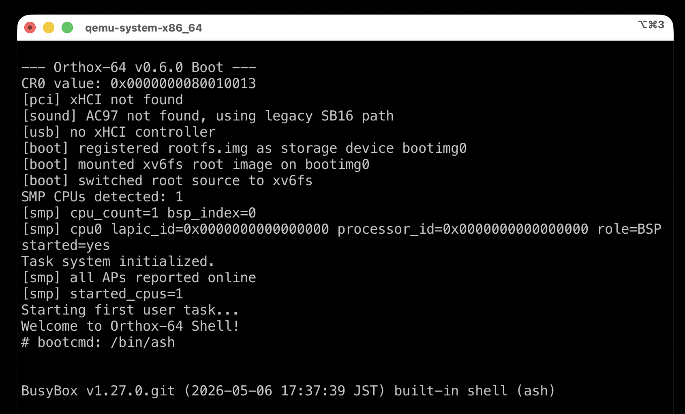
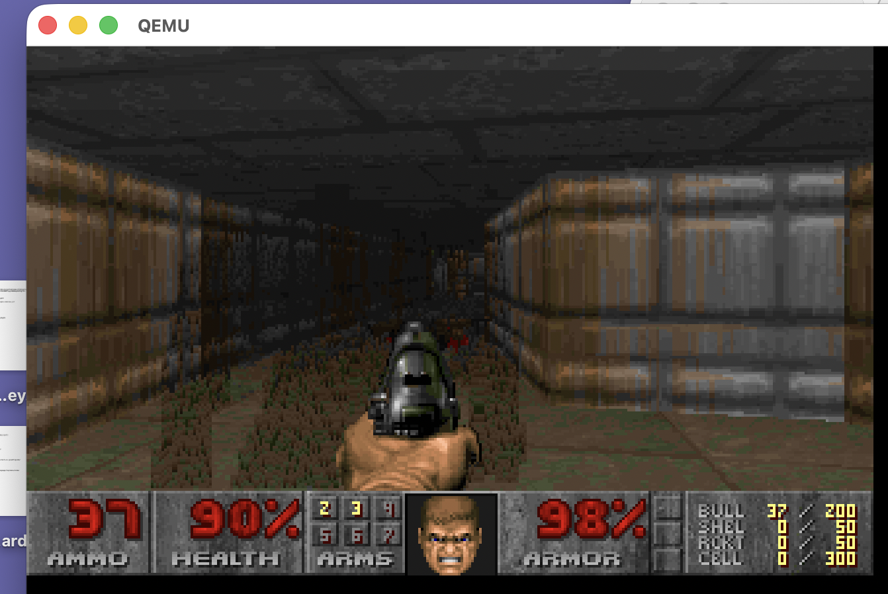

# Orthox-64

Orthox-64 is a project that presents a modern approach to operating system development from scratch.

## Concept and Design Philosophy
- **Etymology:** "Ortho-" comes from orthogonality and correctness, combined with "-x" from the Unix tradition. Orthox-64 aims to be an orthodox, minimal Unix-like operating system.
- **Lightweight & Robust:** Orthox-64 rejects unnecessary system complexity and focuses on a small, stable kernel and userland substrate.
- **Pragmatic Unix Compatibility:** Rather than pursuing full POSIX compliance, it implements the minimum kernel and libc surface needed to run practical software such as BusyBox, GCC, and related toolchain components.
- **Integration over Reinvention:** Orthox-64 does not treat reimplementing every component from scratch as a virtue. Instead, it treats the integration and porting of high-quality existing open-source software as a primary engineering discipline.

## Features
- **64-bit Long Mode:** Runs in full 64-bit mode.
- **Bootloader:** Uses [Limine](https://github.com/limine-bootloader/limine) for modern UEFI/BIOS booting.
- **Memory Management:** PMM (Physical Memory Manager) and VMM (Virtual Memory Manager) with paging.
- **Multitasking:** Preemptive multitasking and kernel threads.
- **File System:** Virtual File System (VFS) and tar-based initial ramdisk.
- **USB Support:** Basic USB stack and Mass Storage Class (MSC) support.
- **Sound:** Audio support via Intel HD Audio.
- **Userland:** Environment based on `musl libc` for better standard compatibility.
- **Ported Apps:** Capable of running ported software like `doomgeneric`.

## Status
The project is currently in active development. Core kernel primitives are stable, and current focus is on improving the userland environment and porting standard tools.

## Acknowledgements
Orthox-64 is inspired by and references the following projects:
- **[MikanOS](https://github.com/uchan-nos/mikanos)**: A modern educational OS by [uchan-nos](https://github.com/uchan-nos). The kernel architecture and some primitive setups were developed with reference to its implementation.
- **[Limine](https://github.com/limine-bootloader/limine)**: Used as the bootloader for modern UEFI/BIOS support.
