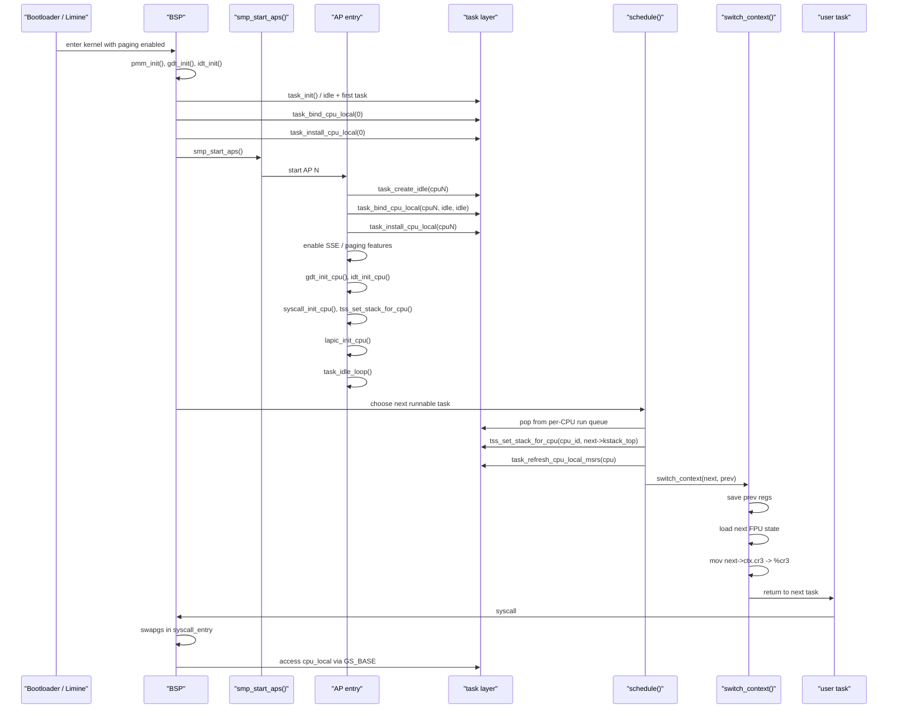

# SMP Design

このメモは、現在の Orthox-64 における SMP と paging の関係を、実装に沿って短く整理したものです。

## 1. SMP と Paging の現状図

```mermaid
flowchart TB
    subgraph CPU0["CPU0"]
        C0RUN["current_task"]
        C0RQ["per-CPU run queue"]
        C0TLB["TLB / MMU state"]
        C0GS["GS_BASE -> cpu_local(0)"]
    end

    subgraph CPU1["CPU1"]
        C1RUN["current_task"]
        C1RQ["per-CPU run queue"]
        C1TLB["TLB / MMU state"]
        C1GS["GS_BASE -> cpu_local(1)"]
    end

    subgraph CPU2["CPU2"]
        C2RUN["current_task"]
        C2RQ["per-CPU run queue"]
        C2TLB["TLB / MMU state"]
        C2GS["GS_BASE -> cpu_local(2)"]
    end

    subgraph CPU3["CPU3"]
        C3RUN["current_task"]
        C3RQ["per-CPU run queue"]
        C3TLB["TLB / MMU state"]
        C3GS["GS_BASE -> cpu_local(3)"]
    end

    subgraph KVA["Kernel Virtual Address Space"]
        KPML4["kernel mappings"]
        KTEXT["kernel text/data"]
        KHEAP["kernel heap / PMM / VMM"]
        KCPU["cpu_local[] / TSS / IST"]
    end

    subgraph TASKA["Task A Address Space"]
        ACR3["CR3 = task A pml4"]
        AUSER["user text / data / stack"]
        AKERN["shared kernel mappings"]
    end

    subgraph TASKB["Task B Address Space"]
        BCR3["CR3 = task B pml4"]
        BUSER["user text / data / stack"]
        BKERN["shared kernel mappings"]
    end

    C0RUN --> ACR3
    C1RUN --> BCR3
    C2RUN --> ACR3
    C3RUN --> BCR3

    ACR3 --> AUSER
    ACR3 --> AKERN
    BCR3 --> BUSER
    BCR3 --> BKERN

    AKERN --> KPML4
    BKERN --> KPML4
    KPML4 --> KTEXT
    KPML4 --> KHEAP
    KPML4 --> KCPU

    C0GS --> KCPU
    C1GS --> KCPU
    C2GS --> KCPU
    C3GS --> KCPU
```

### 要点

- 各 CPU は独自の
  - `current_task`
  - `per-CPU run queue`
  - `TLB`
  - `GS_BASE -> cpu_local`
  を持つ。
- ただし kernel 仮想空間は共通で、
  - kernel text/data
  - heap
  - per-CPU 領域
  は全 CPU から同じ kernel mapping として見える。
- user 仮想空間は task ごとに異なり、`switch_context()` で `CR3` を切り替える。
- したがって SMP で paging が意味するのは
  - CPU ごとに MMU/TLB は別
  - address space は task 単位
  - kernel mapping は共有
  という構造である。

### 実装対応

- `switch_context()` の `mov %rax, %cr3`
  - [`kernel/x86_64/task_switch.S`](/Users/itoh/Github-Orthox-64/kernel/x86_64/task_switch.S)
- `cpu_local` と per-CPU run queue
  - [`include/task.h`](/Users/itoh/Github-Orthox-64/include/task.h)
  - [`kernel/task.c`](/Users/itoh/Github-Orthox-64/kernel/task.c)
- AP ごとの `cpu_local`, GDT, IDT, TSS, LAPIC 初期化
  - [`kernel/smp.c`](/Users/itoh/Github-Orthox-64/kernel/smp.c)

## 2. BSP/AP 起動から CR3 切替までの流れ

### 要点

- BSP も AP も、最初にやるべきことは「CPU ごとの local state を成立させる」ことである。
- AP 側では
  - `task_bind_cpu_local()`
  - `task_install_cpu_local()`
  - `gdt_init_cpu()`
  - `idt_init_cpu()`
  - `syscall_init_cpu()`
  - `tss_set_stack_for_cpu()`
  をそろえてから idle loop に入る。
- scheduler は per-CPU run queue から次 task を選び、
  - TSS の kernel stack
  - `GS_BASE/KERNEL_GS_BASE`
  - `FS_BASE`
  を整えたあと `switch_context()` に入る。
- 最後に `switch_context()` が `CR3` を next task の address space に切り替える。
- user から syscall に入るときは `swapgs` により per-CPU 領域へ着地し、`cpu_local` を参照できる。

### 実装対応

- BSP 側の初期化
  - [`kernel/init.c`](/Users/itoh/Github-Orthox-64/kernel/init.c)
- AP 側の初期化
  - [`kernel/smp.c`](/Users/itoh/Github-Orthox-64/kernel/smp.c)
- per-CPU state と scheduler
  - [`kernel/task.c`](/Users/itoh/Github-Orthox-64/kernel/task.c)
- `CR3` 切替
  - [`kernel/x86_64/task_switch.S`](/Users/itoh/Github-Orthox-64/kernel/x86_64/task_switch.S)
- `swapgs` と syscall entry
  - [`kernel/x86_64/syscall_entry.S`](/Users/itoh/Github-Orthox-64/kernel/x86_64/syscall_entry.S)

## 3. いま残っている paging/SMP 上の本命

- `cache coherence` 自体は x86 ハードウェア前提でよい。
- ただし kernel 側が今後さらに詰めるべきなのは
  - TLB shootdown
  - address space 更新時の同期
  - page table 操作の lock 粒度
である。
- 今回の SMP フェーズで主に潰したのは
  - coherence の欠如ではなく
  - wait/wake, interrupt return, per-CPU state, scheduler ordering
の問題だった。

## 4. 次フェーズ: load balancing と lock 分解の設計メモ

### 4.1 `g_task_lock` 分解の段階案

- 現状は `g_task_lock` 1 本で
  - task state
  - `on_runq`
  - `cpu_affinity`
  - waiter
  - run queue 操作
  をまとめて直列化している。
- この段階では correctness 優先として合理的だが、将来の load balancing を考えると分解方針を先に固定しておく価値がある。

#### Phase 1

- `g_task_lock` 1 本
- state / ready queue / migration 判定をすべて同じ lock で守る

#### Phase 2

- `task_state_lock`
  - `RUNNING/SLEEPING/ZOMBIE/READY`
  - `on_runq`
  - `cpu_affinity`
  - waiter
  - migration 可否判定
- `per_cpu_runq_lock[N]`
  - enqueue / dequeue
  - head / tail / count
  - steal 元 / 先 queue の更新

#### Phase 2 の lock 規約

- 基本順序は
  - `task_state_lock`
  - `runq_lock`
  の順に固定する
- 逆順は禁止する
- 2 個の `runq_lock` が必要なら
  - 低番号 CPU の lock を先に取る
- Orthox-64 の規模では、将来も Phase 2 止まりで十分な可能性が高い

### 4.2 pull-based stealing の基本方針

- work-stealing を入れるなら、基本は `pull` に寄せる
- 既存の wakeup 経路には push 的な動きがすでにあるため、idle pull はその補完と位置づける
- push と pull が衝突しないよう、
  - `READY`
  - `on_runq`
  - `cpu_affinity`
  を lock 下で再確認する必要がある

#### 想定手順

1. 自 CPU の `runq_lock` を取り、本当に queue が空か確認する
2. lock を解放する
3. victim CPU を lock なしの負荷概算で選ぶ
4. victim の `runq_lock` を取る
5. 候補 task を 1 個選ぶ
6. `task_migration_reason_locked()` 相当の条件で safe point 候補か確認する
7. `task_state_lock` を取る
8. `READY && on_runq` などの条件を lock 下で再確認する
9. victim run queue から detach する
10. `task_state_lock` を解放する
11. victim `runq_lock` を解放する
12. 自 CPU の `runq_lock` を取る
13. 自 CPU run queue へ attach する
14. lock を解放する

#### 注意点

- 自 CPU queue が空であることを最初に lock 下で確認しないと、
  - 途中で push された task があるのに steal を続ける
  - 無駄移動が増える
という問題が出る
- 分解後は、候補 task の最終可否判定を
  - victim queue lock だけ
ではなく
  - `task_state_lock` 取得後にも再確認する
方が安全である

### 4.3 `task_migration_reason_locked()` の位置づけ

- migration safe point の判定は、将来 steal 経路が入っても
  - 必ず `task_migration_reason_locked()`
  - または同等の 1 箇所に集約した helper
を通すべきである
- steal 経路が独自判定を持つと、
  - safe point 外 task の移動
  - state invariant の破壊
を再び踏みやすい
- したがって次フェーズでは
  - 「steal / migrate 系は helper を bypass しない」
ことをコメントか `ASSERT` で明示する価値がある

### 4.4 `fork child` と rebalance の初期化完了条件

- 以前の regression では、generic な ready path 側で rebalance を掛けていたため
  - まだ完成していない `fork child`
が migration 対象になり、
  - `RIP=0` の `#PF`
を起こした
- 現在は、
  - rebalance を generic ready path から外し
  - `fork()` 終端に限定している
- 実装上の「初期化完了」は、少なくとも
  - child の task struct
  - address space / `CR3`
  - kernel stack
  - saved context
  - user return 文脈
  - FD 複製
  - `task_list` 接続
が揃ったあとを意味する
- つまりフラグで管理するというより、
  - rebalance を呼ぶ位置そのものを `fork()` 終端へ後退させた
ことで解決している

### 4.5 今後入れるべき `ASSERT`

- work-stealing や lock 分解を進める前に、最低限の invariant を `ASSERT` で明示しておくと事故検出が早い

#### migration / steal 入口

- `READY` であること
- `on_runq` であること
- 適切な lock が保持されていること

#### enqueue 前

- `ASSERT(!task->on_runq)`
- 二重 enqueue 防止

#### dequeue 後

- queue から外れたことの確認

#### `fork child` rebalance 直前

- `ASSERT(child->rip != 0)`
- `ASSERT(child->kstack_top != 0)`
- `ASSERT(child->ctx.cr3 != 0)` または page-table 相当の確認

#### 注意

- 現時点では、上記 `ASSERT` はまだ明示的には入っていない
- 今回の `RIP=0` 問題は
  - unsafe timing を避ける
ことで解決しているが、
  - invariant の明文化
は次フェーズで入れる価値が高い
